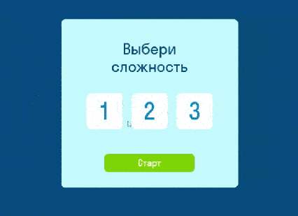

<h1 align="center">Карточная игра "Запомни пары карт" на JS</h1>

<h2 align="left">Описание проекта</h2>

Проект представляет собой игру "Запомни пары карт" для одного игрока. 

Цель игры - безошибочно найти все парные карты.

Просмотреть проект можно на GitHub Pages по ссылке: ###

**Правила игры:**

В начале игры карты раскладываются картинками вверх.
Игроку необходимо запомнить расположение всех парных карт.
Через некоторое время карточки переворачиваются рубашками вверх. 
Далее игрок должен безошибочно найти все парные карты.
Игрок побеждает, если отгадал все карты.

<h2 align="left">Функциональность проекта и использованные технологии</h2>

Внешний вид игры стилизован с помощью HTML и CSS.

Вся логика игры написана на чистом **JavaScript**:

- в игре используются обыкновенные игральные карты:
  - 4 масти (черви, бубны, крести, пики)
  - 9 рангов (6, 7, 8, 9, 10, Q, K, J, A)
- перед началом игры игрок выбирает сложность уровня:
  - легкий уровень - 6 карточек (3 пары)
  - средний уровень - 12 карточек (6 пар)
  - сложный уровень - 18 карточек (9 пар)
- после запуска игры, игроку даётся время, чтобы запомнить расположение карточек;
- раскладка карточек на игровом поле выбирается случайным образом;
- на главном экране отображается таймер, по истечении установленного таймером времени карточки переворачиваются рубашками вверх;
- если игрок открывает две одинаковые карточки, то игра продолжается;
- если игрок открывает разные карточки, то игра останавливается;
- игрок побеждает в случае, когда были найдены все пары карт на игровом поле;
- по окончанию игры, не зависимо от результата, на экране появляется всплывающее окно, в котором отображается:
  - статус (выиграл / проиграл)
  - время, затраченное на игру
  - кнопка, предлагающая сыграть снова
